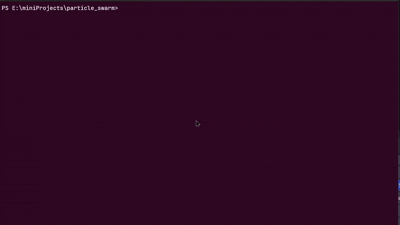

# Particle Swarm Optimization (PSO) 2D Visualization

I tried visualizing Particle Swarm Optimization (PSO) in C using SDL. Particles move toward a goal based on their own best and the swarm’s best, and the goal can be moved with the mouse.

## Demo


## Requirements
- SDL3 library installed on your system.  
- Standard C compiler.  

## How to Run

```bash
build.bat   # compile the code
.\main.exe  # run 
```

Feel free to clone the repo and play with the source code. Thank you for reading.
